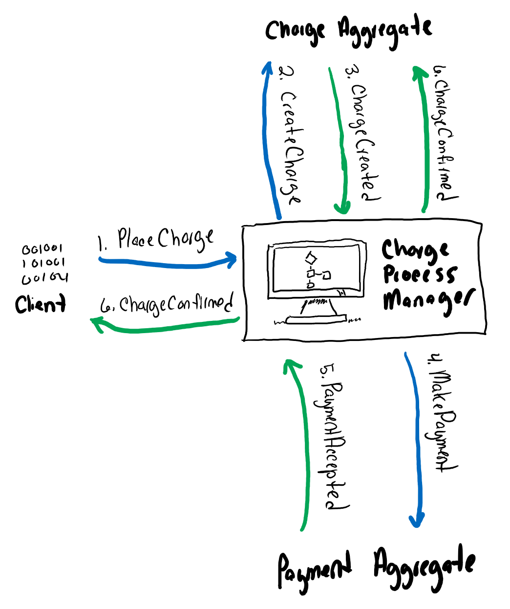

# Payment Gateway
Thanks for taking the time to review my code submission! I've outline below what I've implemented and then some notes and specific improvements I'd like to see if this were a full payment gateway.

## How to run the project

### Verify the connection string
The `PaymentGate/appsettings.Development.json` file uses localdb for convenience. You likely already have LocalDb installed, but if you don't, you can change the server here.

### Run the database migrations.
This can be achieved by opening the solution in Visual Studio and use the Package Manager Console to run the `Update-Database` command.

Alternatively, I have included a dotnet-tools.json file for convenience so that you can install dotnet-ef. Open the solution directory in a command prompt and run the following commands:

```
dotnet tool restore
dotnet ef database update --project PaymentGateway
```

If you run into issues on this step, try [Entity Framework Core tools reference - .NET CLI](https://docs.microsoft.com/en-us/ef/core/miscellaneous/cli/dotnet). If you're still stuck, please feel free to reach out to me.

### Add your API key to your request's header

The API will reject any calls that do not have an `X-Api-Key` header. You can find the API keys in the `Startup.cs` file.

### Use valid inputs

The POST endpoint performs validation on the payload. You can see the rules in `PaymentGateway\Contracts\CreateChargeRequest.cs`. Most of the rules are straightforward, except the credit card validation. A valid POST body (including a valid credit card number) is below for convenience.

```
{
	"idempotent_key": "1234",
	"amount": 4.00,
	"currency": "USD",
	"description": null,
	"card_number": "1234567890123452",
	"cvv": "1234",
	"expiry_month": 1,
	"expiry_year": 2020
}
```

## What I've implemented

### PaymentGateway
This is the Asp.Net Core Web API project where the implementation lives. It's structure is intended to be simple and familiar, but here's a road map to get you oriented.

- **/Authentication** - contains classes that supports authenticating clients with an API key.
- **/Contracts** - Input/Output models used to communicate with our controllers
- **/Controllers** - Our fancy controllers
- **/Model** - The DbContext and some classes that are used to support submitted charges
- **/Services** - Right now just houses the acquiring bank service
- **/Util** - Contains classes that support credit card masking and helpers for detecting unique index violations

#### ChargesController
This is the only implemented controller in this project. You'll see that this controller is decorated with the `[Authorize]` attribute, meaning that you need an API key in your header to call any action method here.

I struggled with how "production-like" to make this controller. Ultimately, I settled for making the code as simple as possible so that reviewers wouldn't have to jump around to understand my code. I wouldn't typically have this much logic for more complicated scenarios, instead having minimal code in the action method and relying on something like the mediator pattern.

##### [GET api/charges](https://github.com/michaelnero/PaymentGateway/blob/7c13466e0d208ba7b9545245d081adb80d272d59/PaymentGateway/Controllers/ChargesController.cs#L34)
This action method is pretty simple: it looks up a charge in the DB and returns it if it's found or a 404 if it's not.

##### [POST api/charges](https://github.com/michaelnero/PaymentGateway/blob/7c13466e0d208ba7b9545245d081adb80d272d59/PaymentGateway/Controllers/ChargesController.cs#L51)
This method is overly simple, and it wouldn't stand up in a real production-like environment. I would make this method more resilient to failure in a more production-like scenario by breaking apart the application so that the Charge record and acquiring bank flows can manage their workflows independently. I would also use resilient queues like Azure Service Bus so that this entire workflow can happen asynchronously and be recoverable. Additionally, I would use event sourcing so we could more easily troubleshoot problems later.

The branch [feature/resilient](https://github.com/michaelnero/PaymentGateway/tree/feature/resilient) shows an example of what this approach would look like in practice. Note that this example is missing significant implementations, most notably some of the event sourcing stuff. Also be aware that this example is much more complex, but the flow can generally be illustrated in the image below.



### PaymentGateway.Tests
This project contains two types of tests
 - **Unit tests** - examples can be found in `/UtilTests/CardNumberUtilTests`.
 - **Integration tests** - examples can be found in
   - `/ControllerTests/ChargesControllerTests.GetTests.cs`
   - `/ControllerTests/ChargesControllerTests.PostTests.cs`

### PaymentGatewayClient
This project contains a simple API client that can be used to call the payment gateway. It is usable by `AddPaymentGatewayClient()` extension method.
